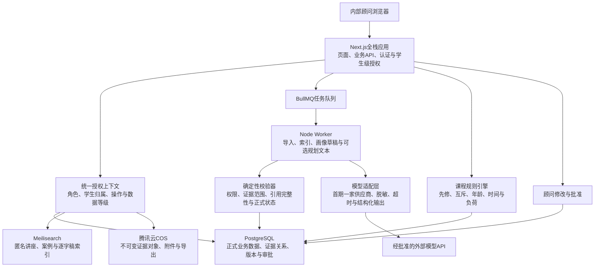
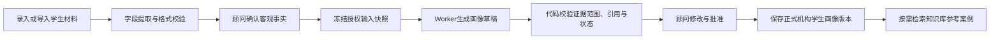
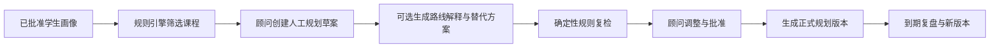

# 醋溜科技智能助手：需求与初步架构设计

> 文档状态：讨论稿  
> 版本：v0.9  
> 更新日期：2026-07-30  
> 开发方式：1名项目负责人独立开发，与Codex、Claude Code等Code Agent协作  
> 目标读者：项目负责人、留学规划顾问、课程研发人员  
> 应用名称：醋溜科技智能助手  

## 1. 项目背景

当前项目已经完成一批留学讲座视频的转录和结构化提取，首批知识资产包括：

- 48场讲座分析报告；
- 169张已经区分性质的卡片，其中包括学生录取案例、项目／成长／反例和证据／机制卡；
- 逐字稿及句级起止时间戳；
- 申请趋势、AI+与跨学科、失败教训、行动建议和证据边界；
- 一份合并版讲座分析文档。

现有内容已经不只是“文档集合”，而是具有明确字段、证据等级和业务用途的知识库。下一阶段计划在此基础上建设一个统一的Web应用，逐步支持：

1. 搜索讲座、案例、提取稿和逐字稿；
2. 建立学生长期档案；
3. 根据机构已有学生本人的材料、记录和顾问观察生成学生画像；
4. 根据画像、课程库和约束条件规划未来课程；
5. 使用受控的单次模型任务辅助顾问分析，并在真实需要出现后评估Multi-Agent；
6. 保留人工审核、证据追溯和版本管理。

本系统不是简单的“上传文档后聊天”，而是一个以知识检索、学生发展和规划决策为核心的业务应用。

## 2. 设计依据与硬性边界

### 2.1 现有依据

- `D:\workshop\留学技术规划案例\202607eduknow\EDU KNOW 2026清单需求.md`
- `D:\workshop\留学技术规划案例\202607eduknow\analysis\2026\_学生画像卡专项审计.md`
- `D:\workshop\留学技术规划案例\202607eduknow\analysis\2026\_全部讲座信息提取_合并版.md`
- `D:\workshop\留学技术规划案例\202607eduknow\2025\` 与 `D:\workshop\留学技术规划案例\202607eduknow\2026\` 下的原始逐字稿及时间戳数据

### 2.2 必须长期保留的原则

1. **原始证据不可被模型覆盖。** 原始逐字稿、时间戳和来源文件保持只读；清理稿、分析稿和模型输出另存。
2. **未披露字段不得补造。** GPA、标化、研究职责、样本规模、影响人数、录取轮次等缺失信息必须明确标为“未披露”或“待确认”。
3. **事实、观点、预测和营销主张分开。** 系统需要保存信息性质与可信度，不能在生成过程中混为确定事实。
4. **案例性质必须清晰。** 学生录取案例、项目／成长片段、趋势证据、机制卡不能混合统计。
5. **录取结果不等于录取因果。** 允许记录机构归因，但不得将某个项目、分数或标签写成确定的录取原因。
6. **学生隐私优先。** 学生正式档案与匿名案例知识库分开存储、分开授权。
7. **正式方案必须人工确认。** 模型只能生成草稿、证据和风险提示，不能自动成为面向学生或家长的最终结论。
8. **MVP优先验证业务闭环。** 业务能力先作为边界清晰、可测试的领域模块实现；只有真实出现热更新、非开发人员维护或动态组合需求后，才演进为Skill Registry和Multi-Agent平台。

### 2.3 核心术语与数据域

为避免“学生画像”与讲座中的匿名案例混淆，本文统一使用以下术语：

| 术语 | 含义 | 主要数据来源 |
|---|---|---|
| **机构学生画像** | 你们机构已经服务或正在服务的真实学生的持续性画像 | 学生档案、成绩、课程、访谈、项目记录、作品、顾问观察、学生／家长反馈 |
| **讲座案例画像卡** | 从讲座中提取的匿名学生录取案例、项目片段或成长案例 | 讲座分析稿、逐字稿和时间戳 |
| **知识库证据** | 用于理解趋势、比较路径和支持规划解释的外部参考 | 讲座、案例卡、趋势、失败教训和原话 |
| **学生本人证据** | 用于确认机构学生事实和形成机构学生画像的直接证据 | 学生文件、访谈、作品、课程记录和顾问核验 |

两类数据属于不同数据域：

- 机构学生画像只能由该学生本人的材料、记录和授权观察形成；
- 讲座案例画像卡可以辅助比较和规划，但不能成为机构学生事实；
- 相似案例只能表达“可参考路径”，不能证明当前学生具有同样能力、经历或录取可能；
- 讲座案例与机构学生之间只保存“参考关系”，不复制或合并事实字段。

## 3. 产品目标

### 3.1 核心目标

- 将现有讲座分析和逐字稿转化为可搜索、可筛选、可追溯的知识数据库；
- 帮助顾问快速找到可供某位机构学生参考的案例、趋势、失败模式和项目方法；
- 将机构已有学生本人的材料和长期记录整理成结构化、可修订、带证据的机构学生画像；
- 将课程目录、先修关系、时间和学习目标转化为可执行的阶段性课程规划；
- 让大模型可替换，让搜索和正式业务数据不依赖某一家模型服务；
- 为后续项目规划、活动规划、申请策略和报告生成预留扩展能力。

### 3.2 非目标

初期不计划：

- 上传或在线播放原始视频；
- 自动预测某所大学的录取概率；
- 让Agent未经审核自动修改学生正式档案；
- 让大模型独立决定课程先修关系或安全边界；
- 构建完全自主、可以无限调用工具的开放式Agent群；
- 用模型生成的信息覆盖原始讲座证据；
- 在第一版实现面向外部客户的大规模SaaS计费体系。

## 4. 用户角色

| 角色 | 主要需求 | 权限边界 |
|---|---|---|
| 管理员 | 用户、课程库、模型配置、数据导入、审计 | 可管理系统配置，不默认查看全部学生敏感资料 |
| 规划顾问 | 建档、画像、案例检索、规划、审核、导出 | 仅查看被授权学生 |
| 课程研发 | 维护课程、先修关系、适用人群和课程证据 | 不查看无关学生身份信息 |
| 内容研究人员 | 导入讲座、修订标签、核验证据 | 主要处理匿名知识库 |
| 学生／家长（后MVP） | 查看已批准画像和规划、补充材料、反馈 | MVP不提供独立账号；后续也不能查看内部评语、其他学生案例身份或模型日志 |
| 系统服务账号 | 执行索引、模型调用、定时任务 | 使用最小权限和独立密钥 |

## 5. 核心使用场景

### 5.1 讲座与案例搜索

用户可以：

- 按关键词搜索讲座、案例卡、趋势、失败教训和逐字稿；
- 按年份、学校、专业、课程体系、案例性质、AI深度、研究方法等筛选；
- 查看命中内容的上下文、来源报告和逐字稿时间戳；
- 从案例卡返回讲座，从讲座返回原始逐字稿证据；
- 收藏、比较和导出搜索结果；
- 在不调用大模型的情况下完成普通搜索。

示例查询：

- “Brown 数学 哲学 社区活动”
- “使用NLP但没有披露数据规模的案例”
- “无顶级竞赛的理工录取案例”
- “心理健康项目常见失败风险”

### 5.2 学生建档

顾问可以录入或导入：

- 基础身份、年级、学校地区与课程体系；
- GPA、排名、标化和课程成绩；
- 兴趣、课程、科研、竞赛、活动、作品和长期投入；
- 每项经历的时间、角色、成果、用户、合作方和证据；
- 学生可用时间、预算、目标和限制条件；
- 访谈记录、顾问观察和学生／家长反馈。

系统必须区分：

- 客观事实；
- 学生或家长自述；
- 顾问观察；
- 外部文件证据；
- 模型推断；
- 尚未确认的信息。

### 5.3 学生画像生成

本功能面向你们机构已经服务或正在服务的真实学生。系统根据该学生本人已经授权并确认的材料、历史记录和顾问观察生成画像草稿，包括：

- 学术基础；
- 兴趣起点与长期学术主线；
- 课程、科研、竞赛和活动之间的连接；
- 学生真实职责与成果强度；
- 跨学科组合与AI深度；
- 人物特质的行为证据；
- 信息缺口、矛盾和风险；
- 一句话学术标签；
- 后续需要通过访谈确认的问题。

机构学生画像的数据来源包括：

- 学生基础档案和历次访谈；
- 成绩单、课程记录和标化结果；
- 科研、竞赛、活动、作品和项目过程记录；
- 学生、家长和教师／导师反馈；
- 顾问长期观察与人工核验；
- 已批准的历史画像和规划版本。

讲座案例画像卡不参与机构学生事实提取。系统可以在画像形成后检索相关案例，作为顾问理解、课程规划和路线比较的参考，但必须单独显示为“知识库参考”，不得写入学生事实或用来填补学生缺失字段。

每条重要结论必须带有：

- 一份或多份学生本人证据引用及其具体定位；
- 每份证据与结论的关系：支持、反驳或部分支持；
- 信息性质；
- 置信度；
- 是否已人工确认；
- 生成时间、模型版本和输入快照哈希。

### 5.4 未来课程规划

系统根据学生画像和正式课程库生成阶段性规划：

- 推荐课程及推荐理由；
- 先修课检查；
- 学期／季度安排；
- 每周学习负荷；
- 目标能力和可交付成果；
- 与学生主线、项目或申请方向的连接；
- 替代路线；
- 风险、依赖项和复查时间；
- 不推荐课程及原因。

课程规划采用“规则+模型”：

- 规则引擎负责先修关系、年龄、课程难度、时间冲突、容量和硬性限制；
- 模型负责解释匹配原因、比较路线、提出衔接建议和生成易读报告；
- 顾问负责最终决策。

### 5.5 RAG问答与模型任务

MVP优先支持：

- 针对全部匿名知识库问答；
- 针对某位获授权学生问答；
- 生成一次访谈的问题清单；
- 识别学生材料中的信息缺口；
- 生成学生画像草稿；
- 从规则引擎筛选后的集合生成课程规划解释。

比较多个案例、复杂链式任务以及学生版、家长版等多版本自动输出属于后MVP评估项。模型输出只进入草稿区；证据合法性、课程规则和正式状态由代码校验。

## 6. 功能需求

### 6.1 知识导入与治理

- 支持Markdown、JSON、TXT和SRT；
- 解析讲座九部分结构和案例卡；
- 解析句级时间戳；
- 支持内容哈希和增量更新；
- 支持标签映射、重复检测和导入审计；
- 原始层、清理层、分析层和索引层分离；
- 索引可以重建，原始数据不可因重建丢失；
- 导入失败必须记录文件、原因和重试状态。

### 6.2 搜索

- 中文全文搜索；
- 关键词高亮、拼写容错和同义词；
- 多条件过滤与分面统计；
- 标题、案例标签、正文和原话采用不同权重；
- 支持排序、分页、收藏和结果对比；
- 支持精确短语搜索；
- 支持从搜索结果跳转到证据时间戳；
- 后续可增加语义检索和关键词／向量混合检索。

### 6.3 学生画像

- 字段化编辑，不只保存一段总结；
- 支持多份材料和证据绑定；
- 支持画像版本、变更比较和回滚；
- 支持“未披露／未确认／存在矛盾”状态；
- 顾问可接受、修改或拒绝模型建议；
- 模型不得直接写入已确认字段；
- 支持匿名化副本，用于内部案例沉淀。

### 6.4 课程库与规划

- 课程名称、阶段、难度、目标、先修课、周期、课时和交付物；
- 适用年龄、能力基础和不适用条件；
- 课程之间的前置、并行、替代和进阶关系；
- 课程与能力标签、学科、项目类型的映射；
- 规划版本、审批状态和复查日期；
- 自动检测时间冲突、能力断层和负荷过高；
- 保留顾问手工覆盖规则的原因和记录。

### 6.5 审核与输出

- 事实和证据审核；
- 课程规则审核；
- 隐私与敏感信息检查；
- 模型过度推断检查；
- 内部报告、学生报告、家长报告采用不同模板；
- 所有正式输出标明版本、生成日期和批准人；
- 支持Markdown，后续扩展DOCX和PDF。

### 6.6 管理功能

- 用户、角色与学生授权；
- 数据源和索引状态；
- 模型供应商、模型和调用额度；
- 提示词／工作流版本；
- 模型任务运行日志、成本和失败重试；
- 数据备份、恢复和导出；
- 敏感操作审计日志。

以下管理能力明确属于后MVP：Skill安装、权限审核、升级与回滚，Agent与Skill动态绑定，以及Tool Registry管理后台。

## 7. 总体架构

### 7.1 MVP实施架构

MVP采用“Node.js／TypeScript单仓库全栈应用+独立Worker+结构化数据库+可重建搜索索引+确定性校验与规则+可替换模型适配器”。Skill Registry、Tool Registry、Skill Runtime和Multi-Agent编排不属于MVP运行架构。



### 7.2 各组件职责

| 组件 | 职责 |
|---|---|
| Next.js全栈应用 | 页面、搜索、录入、编辑、对比、审批、身份认证、学生级服务端授权和业务API |
| 统一授权上下文 | 根据当前用户、学生归属、操作类型和数据等级生成服务端查询范围；模型不能提供或扩大该范围 |
| Node Worker | 批量导入、索引重建、画像草稿、可选规划文本、重试和定时任务 |
| 确定性校验器 | 校验证据存在性、所属学生、访问权、版本、数据域、引用完整性和正式状态转换 |
| PostgreSQL | 学生、课程、画像、规划、证据关系、版本、审核和正式状态 |
| Meilisearch | 可重建的全文检索索引 |
| 文件／对象存储 | 保存不可变原始文件、附件、导出报告和证据对象版本 |
| 课程规则引擎 | 执行确定性的先修、互斥、年龄、时间、难度和负荷规则 |
| 模型适配层 | 首期接入一家经批准供应商，执行字段白名单、脱敏、超时、结构化输出校验和成本记录 |
| AnythingLLM | 可选的内部问答／实验工具，不作为正式业务数据库 |

### 7.3 工程组织决策：Node.js／Next.js单仓库

**决策状态：已确认。**

本项目采用Node.js技术栈，并以TypeScript作为主要开发语言。Next.js作为主要全栈Web框架，在同一个代码仓库中承载页面和业务API，第一版不再建立独立的第二套后端工程。

需要区分三个概念：

- **同一个工程：** 前端、业务API、Agent、数据库访问和共享类型位于同一个代码仓库；
- **逻辑分层：** 页面、业务领域、数据库、搜索、模型和Agent仍然保持清晰模块边界；
- **独立进程：** 耗时任务由同仓库中的Node Worker运行，不占用普通Web请求。

推荐的仓库结构：

```text
project/
├─ apps/
│  ├─ web/                 # Next.js页面、Route Handlers和权限
│  └─ worker/              # 导入、索引、RAG和Agent长任务
├─ packages/
│  ├─ domain/              # 学生画像、课程规划和业务规则
│  ├─ database/            # PostgreSQL模型与数据访问
│  ├─ search/              # Meilisearch索引与查询
│  ├─ authorization/       # 统一学生级授权上下文和范围查询
│  ├─ evidence/            # 证据对象、定位、引用和确定性校验
│  ├─ ai/                  # 模型适配、脱敏和结构化输出
│  ├─ tasks/               # 单次画像、规划文本等后台任务
│  └─ shared/              # 共享类型、校验和通用工具
├─ infra/
│  └─ docker-compose.yml
└─ package.json
```

MVP从第一次批量导入、索引重建或模型任务开始即启用独立Node Worker与任务队列。Web请求只负责创建任务、查询状态、取消允许取消的任务和展示结果，不同步执行长任务。

只有在未来出现多个独立客户端、对外开放API、大规模并发，或后续团队扩充并需要独立发布后端时，才重新评估是否将业务API拆成单独服务。单仓库决策不影响未来拆分。

### 7.4 后MVP演进：Skill与Multi-Agent

Skill-Driven和Multi-Agent保留为长期演进方向，不再作为MVP硬性架构原则。MVP中的搜索、证据、画像、课程规则和规划能力先作为普通TypeScript领域模块实现，并通过稳定的输入输出Schema、权限接口和测试保持可提取性。

只有以下需求真实出现后，才评估Skill Registry：

1. 内部闭环已经被顾问持续使用并认可；
2. 能力模块数量明显增长，且多个任务需要动态组合；
3. 非开发人员需要在不重新部署的情况下维护提示词或Schema；
4. 需要安装外部能力包、独立授权、版本锁定或回滚。

后MVP如允许代码型Skill，只能加载经过代码审查和签名验证的包，并在受限Worker或隔离容器中运行。MVP不允许管理员上传或执行第三方代码型Skill；仓库内置TypeScript模块可以调用经过代码审查的实现，其工具和数据权限必须固定并可审计。

## 8. MVP模型任务与后MVP Agent设计

### 8.1 MVP原则

MVP不建设多个Agent的链式编排，只实现可单独触发、输入冻结、输出可校验的后台模型任务：

- 模型任务只能接收服务端根据授权上下文准备的输入快照；
- 模型不能选择学生、修改学生ID、扩大数据范围或直接调用任意数据库查询；
- 所有输出先进入草稿区，通过Zod Schema和确定性业务校验后才可展示；
- 模型任务不得写入人工确认字段或直接转换正式状态；
- 正式数据库是事实源，对话历史和模型输出不是事实源；
- 失败、超时或模型不可用时，搜索、建档和人工规划仍然可用。

### 8.2 MVP模型任务

| 任务 | 输入 | 输出 | 前置依赖 | 是否必做 |
|---|---|---|---|---|
| 知识库摘要问答 | 匿名搜索命中结果和证据定位 | 带来源的摘要、限制说明 | 普通搜索和50条金标查询通过 | 可选 |
| 学生画像草稿 | 当前学生已授权输入快照、字段规范 | 画像字段草稿、证据引用、缺口和待确认项 | 证据模型、授权和引用校验器通过 | 必做 |
| 课程规划文本 | 规则引擎给出的可选集合、已批准画像和人工草案 | 路线解释、替代方案、风险与复查点 | 课程规则和人工规划通过 | 可选 |
| 审核提示 | 已通过代码校验的画像或规划草稿 | 可能的冲突、夸大和隐私提示 | 稳定输出Schema | 后MVP评估 |

学生画像草稿只依赖当前学生本人材料、顾问观察和已批准历史记录，不依赖知识库检索任务。知识库案例只能在画像形成后建立独立参考关系，用于路线比较和规划解释。

### 8.3 可信边界

以下能力必须由确定性代码执行，不得交给生成模型或审核模型：

- 身份认证、学生级授权和数据访问范围；
- 证据ID存在性、所属学生、访问权和版本有效性；
- 学生证据与讲座案例的数据域隔离；
- 正式画像中的事实性结论是否具有合法学生本人证据；
- 课程先修、互斥、年龄、时间和负荷规则；
- 正式状态转换、批准人和批准时间；
- 文件哈希、导入幂等、备份和审计。

后MVP如引入审核Agent，其定位只能是“问题提示器”，不能作为权限、安全、引用或发布的可信边界。

## 9. 关键业务流程

### 9.1 学生画像流程



画像生成链路和知识库参考链路必须分开。知识库案例可以帮助顾问提出问题、比较路线和规划后续课程，但不得反向改变已经确认的学生事实。

### 9.2 课程规划流程



## 10. 初步数据模型

### 10.1 知识库

| 实体 | 关键字段 |
|---|---|
| `source_document` | 来源、路径、哈希、类型、日期、版本、只读状态 |
| `lecture` | 标题、日期、机构、嘉宾、申请年份、学校、专业、信息性质 |
| `transcript_segment` | 讲座ID、起止时间、原文、清理文本、来源句ID |
| `case_card` | 卡片性质、背景、学术标签、结果、证据边界、隐私等级 |
| `case_evidence` | 卡片ID、证据ID、时间戳、字段、可信度 |
| `trend_item` | 趋势、判断、依据、适用范围、可信度、反对证据 |
| `tag` | 学科、学校、课程体系、研究方法、AI深度、活动类型 |

### 10.2 学生与规划

| 实体 | 关键字段 |
|---|---|
| `student` | 内部ID、基本资料、隐私等级、负责人、状态 |
| `student_authorization` | 用户、学生、允许操作、数据等级、有效期、授予人 |
| `student_fact` | 学生ID、字段、值、来源类型、确认状态、有效时间、`supersedes_id` |
| `evidence_object` | 所属数据域、学生ID、不可变版本、内容哈希、存储位置、上传者、访问等级、创建时间 |
| `evidence_locator` | 证据对象ID、页码、段落、字符区间、单元格、时间戳或记录字段 |
| `fact_evidence` | 学生事实ID、证据定位ID、关系类型（支持／反驳／部分支持）、校验状态 |
| `experience` | 课程／科研／活动／竞赛、角色、时长、成果和影响 |
| `profile_version` | 画像版本、状态、生成来源、批准人、批准时间、`input_snapshot_hash`、`invalidation_reason` |
| `profile_claim` | 画像版本、结论、性质、置信度、确认状态、失效状态 |
| `claim_evidence` | 结论ID、证据定位ID、关系类型（支持／反驳／部分支持）、备注、校验状态 |
| `student_knowledge_reference` | 学生／画像／规划与讲座案例之间的参考关系、用途和顾问备注，不存为学生事实 |
| `course` | 课程信息、难度、周期、能力标签、交付物 |
| `course_rule` | 规则类型、条件、结果、版本、状态、替代、年龄、时间和负荷约束 |
| `plan_version` | 规划版本、周期、状态、目标、批准信息、规则版本、`input_snapshot_hash`、`invalidation_reason` |
| `plan_item` | 课程／项目、时间、理由、依赖、成果、替代项 |
| `review_record` | 审核类型、问题、处理结果、审核人 |
| `model_task_run` | 任务类型、授权上下文ID、模型、提示版本、输入引用集合、输入快照哈希、脱敏规则版本、输出引用、成本、状态 |
| `audit_event` | 用户或服务账号、操作、学生ID、对象、结果、时间、请求关联ID |

### 10.3 后MVP Skill、Agent与工作流

`skill_package`、`skill_version`、`skill_installation`、`tool_definition`、`agent_definition`、`agent_skill_binding`和`workflow_definition`均为后MVP目标，不在首期建立空表或管理功能。MVP只记录Git提交SHA、提示词内容哈希、Schema内容哈希、模型版本和每次任务实际输入输出版本。

### 10.4 数据真相层级

从高到低：

1. 已验证原始文件和正式课程数据；
2. 顾问人工确认的学生事实；
3. 有来源的学生／家长自述；
4. 讲座嘉宾或机构口述；
5. 顾问分析；
6. 模型推断；
7. 未确认线索。

任何生成输出均不得悄悄改变这一层级。

机构学生画像中的事实性结论只能引用当前学生的`student_fact`和`evidence_object`／`evidence_locator`。`case_card`和`case_evidence`只能进入知识库参考关系或规划解释，不能作为当前学生个人事实的证据。正式画像或规划所依赖的事实、证据、课程和规则发生变化时，系统必须根据输入快照标记受影响版本为“需要复查”，并记录失效原因。

## 11. 搜索索引设计

初期建议至少建立三个Meilisearch索引：

### 11.1 `lectures`

- `lecture_id`
- `title`
- `date`
- `organization`
- `speakers`
- `schools`
- `majors`
- `summary`
- `trend_text`
- `ai_cross_disciplinary_text`
- `failure_text`
- `source_path`

### 11.2 `cases`

- `case_id`
- `lecture_id`
- `case_type`
- `academic_label`
- `background`
- `curriculum_system`
- `schools`
- `admission_result`
- `major`
- `research_methods`
- `activity_types`
- `ai_domains`
- `ai_depth`
- `evidence_boundary`
- `confidence`
- `timestamp_refs`

### 11.3 `transcript_segments`

- `segment_id`
- `lecture_id`
- `start_seconds`
- `end_seconds`
- `text`
- `section`
- `case_ids`
- `source_path`

学生敏感资料不应直接进入公共案例索引。若未来确需搜索学生档案，应使用独立索引、单独访问密钥和服务端权限过滤。

## 12. 模型与RAG设计

### 12.1 模型可替换与数据出站

MVP只接入一家经过数据策略审核的模型供应商，同时保持稳定的内部适配接口，避免正式业务数据与供应商SDK耦合。后续有真实成本、可用性或能力需求时，再增加DeepSeek、Kimi、GLM或本地模型等其他实现。

模型适配层统一负责：

- 按任务配置固定模型，不进行多模型自动路由；
- 超时和重试；
- 结构化输出校验；
- 调用额度与成本；
- 字段出站白名单、直接身份字段替换和敏感字段阻断；
- 提示词、模型、脱敏规则和输入快照版本记录；
- 禁止在应用日志、缓存和错误追踪中保存不必要的完整学生材料。

接入供应商前必须记录：输入输出是否留存、是否用于训练、能否关闭留存或训练、数据存储地区、删除机制和合同／控制台配置。健康、心理、家庭等高敏感内容默认禁止出站，确有业务必要时需单独批准并记录。

### 12.2 检索策略

第一阶段：

- 以Meilisearch关键词、筛选和字段权重为主；
- RAG引用搜索命中的案例和逐字稿证据；
- 所有回答显示引用。

后续：

- 增加向量索引；
- 使用关键词+语义混合召回；
- 对召回结果重排；
- 评估是否需要独立向量数据库。

不建议在尚未建立检索评测集之前，以纯向量检索替代现有结构化搜索。

## 13. AnythingLLM的定位

AnythingLLM可作为：

- 内部快速文档问答工具；
- 模型和提示词试验环境；
- 早期Agent或MCP能力验证入口；
- 非正式知识探索界面。

AnythingLLM不作为：

- 学生正式档案数据库；
- 课程规则真相源；
- 正式画像和规划的唯一存储；
- 权限和审批流程的核心；
- Meilisearch的替代品。

如果保留AnythingLLM，可通过内部API或MCP调用：

- `search_cases`
- `search_lectures`
- `search_transcripts`
- `get_evidence`

正式业务仍由自研Web应用承载。

## 14. 部署设计

### 14.1 初期部署目标

采用腾讯云服务器部署核心服务，本地或云端前端均可通过HTTPS访问。

建议首期使用Docker Compose：

```text
腾讯云服务器
├─ Nginx／HTTPS
├─ Next.js全栈应用（页面＋业务API）
├─ Node Worker（批量导入或首个模型任务起启用）
├─ PostgreSQL
├─ Meilisearch
├─ Redis／BullMQ
└─ 备份任务

腾讯云COS或挂载存储
└─ 原始文档、附件、导出报告和备份

经数据策略审核的外部模型API
└─ MVP首期供应商
```

### 14.2 网络边界

- Meilisearch和PostgreSQL不直接暴露到公网；
- 浏览器只访问Next.js应用公开的页面和业务API，不直接持有Meilisearch管理密钥；
- 所有模型密钥保存在服务器环境变量或密钥服务；
- 管理后台启用更严格的身份验证；
- 本地开发或独立客户端也必须通过受保护的HTTPS业务API访问；
- 对外分享的报告使用临时链接或授权页面。
- 所有学生档案、附件、导出、学生范围搜索和模型任务均通过统一授权上下文访问；
- Worker只能使用任务创建时冻结的授权范围，不能接受模型返回的学生ID作为查询条件。

### 14.3 备份

- PostgreSQL每日备份；
- 原始文档和正式报告进入对象存储版本管理；
- Meilisearch索引可由数据库和原始文件重建；
- 配置、提示词和规则版本纳入备份；
- 至少每季度抽测数据库和对象文件能否实际恢复，并记录恢复时间和缺失项；
- 明确备份保留周期、加密方式和备份访问权限。

### 14.4 单机资源与运行限制

- 为Web、Worker、PostgreSQL、Redis和Meilisearch设置容器资源限制；
- 设置Worker并发上限、单任务超时、有限重试和幂等键；
- 设置PostgreSQL连接数限制和连接池；
- 设置磁盘空间、队列积压和连续任务失败告警；
- 配置日志轮转和备份保留策略；
- 批量导入和索引重建不得影响普通搜索、建档和人工规划。

## 15. 安全、隐私与合规要求

- 学生使用内部随机ID，不以姓名作为主键；
- 匿名讲座案例与真实学生档案逻辑隔离；
- 讲座案例索引和机构学生数据使用独立的数据表、访问策略和权限；
- 不允许通过导入或模型任务把讲座案例字段复制为机构学生事实；
- 所有学生档案、附件、导出、学生范围搜索和模型任务必须由服务端统一授权上下文限定范围；
- 页面隐藏不等于授权，Route Handler、Worker和文件临时链接必须执行同一套权限检查；
- 模型不得提交学生ID或证据ID来扩大查询范围，代码必须校验证据存在性、归属、访问权、版本和数据域；
- 禁止在生产Next.js进程中直接安装或加载未经审核的npm依赖；
- 敏感文件加密传输和存储；
- 用户登录、查看、修改、批准、导出、下载、删除和权限变更均记录审计日志；
- 发送给外部模型前执行字段出站白名单、直接身份字段替换和敏感字段阻断；
- 未成年人信息不得发送给会将输入用于训练或无法满足已批准留存策略的供应商；
- 匿名案例仍需防止通过学校、地区、成绩、兴趣组合反向识别；
- 支持数据导出、更正、归档和按授权删除；
- 健康、心理、身份、家庭情况等敏感字段采用更高权限等级，默认禁止模型出站；
- 日志、缓存、队列失败记录和错误追踪不得保存不必要的完整学生材料和模型密钥；
- 模型任务、提示词版本、输入引用、脱敏规则版本、输出状态和人工批准结果必须可追溯。

## 16. 非功能需求

以下为第一阶段讨论目标，并非最终SLA：

| 维度 | 初步目标 |
|---|---|
| 搜索性能 | 常规关键词搜索P95小于500毫秒，不含公网延迟 |
| 可追溯性 | 正式画像的重要事实性结论必须绑定至少一份合法学生本人证据；人工判断必须明确标记 |
| 数据完整性 | 原始文件只读，索引可重建，版本变更可审计 |
| 模型独立性 | 更换模型供应商不影响搜索和正式业务数据 |
| 可维护性 | Git提交、提示词、Schema、规则、模型和数据结构均有版本 |
| 可观测性 | 记录导入、搜索、模型任务、失败、耗时和成本；同时具备错误通知、磁盘和任务失败告警 |
| 可用性 | 模型服务不可用时，搜索、档案和人工规划仍可工作 |
| 中文支持 | 中文搜索、字段、报告和UTF-8导入导出完整可用 |
| 后台任务 | Worker具有并发上限、超时、幂等键、有限重试和失败恢复；半完成结果不得进入正式状态 |
| 恢复能力 | 数据库和对象文件备份至少每季度完成一次可记录的恢复抽测 |

### 16.1 单人+Code Agent开发约束

本项目只有一名人类项目负责人。项目负责人同时承担产品决策、架构把关、代码所有权、安全责任、发布批准和进度管理；Codex、Claude Code等Code Agent用于实现、测试、重构、文档和辅助审查，但不承担最终责任。

数据真相、证据关系、学生访问权限、敏感字段、课程规则语义、画像合格标准和正式发布阻断条件必须由项目负责人确认；涉及顾问业务判断时，应取得实际使用顾问的明确反馈。Code Agent不得自行决定或悄悄修改这些业务不变量。

工作分工如下：

| 工作 | 主责 | 说明 |
|---|---|---|
| 范围、业务规则、安全边界和验收口径 | 项目负责人 | 形成ADR、任务说明和阻断条件 |
| 脚手架、Schema、迁移、业务实现和页面 | Code Agent | 按限定文件范围完成并提交变更说明 |
| 单元、集成、权限负例、规则和回归测试 | Code Agent | 编写并实际运行，失败后继续修复 |
| 静态检查、敏感信息扫描和文档同步 | Code Agent | 作为每个任务的固定完成条件 |
| 真实数据抽查、业务结果判断和模型输出验收 | 项目负责人 | 记录通过、问题和返工要求 |
| 关键代码独立复核 | 独立Code Agent会话 | 不复用实现会话结论，重点寻找反例 |
| 合并、生产配置、密钥、备份恢复和发布 | 项目负责人 | 最终责任不交给Code Agent |

每个开发任务至少明确：

1. 目标与非目标；
2. 允许修改的文件范围；
3. 输入输出Schema；
4. 权限要求和业务不变量；
5. 正例、反例和边界验收用例；
6. 必须运行的检查命令；
7. 禁止自行引入的依赖和抽象。

单人开发不同时推进多个会修改核心Schema、权限层或迁移文件的任务。每次只完成一个可验证的纵向切片，再开始下一个；所有Code Agent任务必须限定目标、文件范围和验收命令。

每次合并至少执行严格类型检查、ESLint、单元测试、数据库迁移检查、Zod Schema测试、权限负例测试、课程规则测试、导入幂等测试、模型结构化输出测试和敏感信息扫描。关键权限、规则和迁移应交给一个未参与实现的独立Code Agent会话复核；复核会话必须读取ADR和业务不变量，并主动补充反例，不能直接沿用实现任务的上下文和结论。

每完成一个阶段，项目负责人应保存可运行版本、更新ADR与实施状态、执行恢复性检查，并记录下一阶段明确的输入、非目标和退出条件，降低长周期单人开发中的上下文丢失风险。

### 16.2 架构决策记录

仓库应使用简短ADR记录：PostgreSQL与Meilisearch分工、学生事实与讲座案例分域、证据模型、学生级授权、课程硬规则、Worker启用时机、模型出站策略、正式状态转换，以及MVP不建设动态Skill Registry的原因。AI Coding工具开始相关任务前必须先读取这些ADR。

## 17. MVP范围

第一版建议只建设一个可验证的闭环。

### 17.1 MVP包含

1. 导入48场分析报告和对应逐字稿；
2. 讲座、案例和逐字稿搜索；
3. 案例筛选、详情和时间戳证据；
4. 内部顾问账号、基础角色和学生级服务端授权；
5. 学生结构化建档；
6. 不可变证据对象、具体定位、事实确认和结论—证据关系；
7. 通过Worker运行一次性学生画像草稿任务；
8. 确定性证据范围和引用合法性校验；
9. 顾问修改、批准、版本比较和失效标记；
10. 基础自有课程库；
11. 先修、互斥、年龄、时间和负荷规则；
12. 人工课程规划和自动规则检查；
13. 可选的规划解释文本生成；
14. Markdown报告导出；
15. 基础审计、备份和恢复抽测。

### 17.2 MVP暂缓

- 自动录取概率；
- 自主执行的开放式Agent；
- 面向学生的聊天机器人；
- 复杂CRM和销售功能；
- 移动App；
- 多机构租户；
- 自动计费；
- 视频播放；
- 大规模向量数据库；
- 四个Agent的链式编排；
- 独立审核Agent作为正式关口；
- 约10个Skill的平台化拆分；
- 动态Skill Registry与管理后台；
- Tool Registry管理后台；
- 多模型自动路由；
- 复杂工作流引擎；
- AnythingLLM正式业务集成；
- 任意第三方代码型Skill；
- 公共Skill市场和自动更新；
- 自动向外部平台发送消息；
- 学生和家长独立账号及门户；
- DOCX和PDF正式导出。

## 18. 分阶段实施建议

### 阶段0：业务标准和开发约束

- 确定知识库和学生档案字段；
- 确定证据对象、定位、关系、失效和输入快照模型；
- 确定课程字段和硬规则语义；
- 确定内部角色、学生授权关系、敏感字段和模型出站策略；
- 建立至少50条搜索金标查询和20—30个代表性画像案例；
- 建立ADR、CI、严格类型检查、Lint、测试和敏感信息扫描基线；
- 编写现有48场内容的导入与校验程序；
- 未完成上述业务不变量前，不开始画像或规划模型任务。

### 阶段1：知识搜索MVP

- 部署Meilisearch；
- 完成讲座、案例和逐字稿索引；
- 开发搜索、筛选、详情和证据跳转；
- 使用顾问金标查询验证中文切分、中英文混合名称、别名、缩写、精确短语、负面条件和字段权重；
- 可选增加单次RAG摘要，不引入Agent编排。

### 阶段2：学生档案和画像试点

- 建立学生级服务端授权、档案和证据关系模型；
- 完成字段化编辑、版本、输入快照和失效标记；
- 通过Worker运行一次性画像草稿任务；
- 由代码校验证据范围、引用合法性和正式状态；
- 顾问完整修改并批准；
- 使用20—30个具有代表性、受控的学生案例试点。

### 阶段3：课程规则和人工规划

- 结构化现有课程库；
- 实现先修、互斥、年龄、时间和负荷规则；
- 完成正例、反例、边界、组合、矛盾和循环测试；
- 先提供人工规划和自动规则检查；
- 记录规则覆盖原因、批准人和受影响规划的复查状态。

### 阶段4：生成式规划和受控任务

- 模型只从规则引擎筛选后的课程集合生成路线解释；
- 增加替代路线、风险和复查点；
- 增加任务幂等、超时、有限重试和失败恢复；
- 评估审核提示任务是否真正带来增量价值；
- 仅在多个独立任务无法满足真实工作流时，再评估Multi-Agent。

### MVP实际工时估算（阶段0—4）

估算终点是完成§17.1的内部MVP范围，并通过§19的内部上线门禁。估算将“项目负责人人工工时”和“Code Agent任务执行时长”分开，Code Agent承担主要开发、自动化测试和修复工作，项目负责人主要负责决策、验收与记录。

| 工作阶段 | 项目负责人人工工时 | Code Agent任务时长 | 主要人工工作 |
|---|---:|---:|---|
| 阶段0：标准与工程基线 | 6—10小时 | 8—12小时 | 确认边界、审核ADR和评测样本 |
| 阶段1：匿名知识搜索 | 6—10小时 | 16—24小时 | 抽查导入结果、标注并验证50条查询 |
| 阶段2：学生档案与画像试点 | 14—20小时 | 32—48小时 | 检查授权与证据、验收20—30个案例 |
| 阶段3：课程规则与人工规划 | 8—12小时 | 20—30小时 | 确认规则语义、抽查反例和规划结果 |
| 阶段4：生成式规划解释（可选） | 5—8小时 | 12—18小时 | 判断文本价值、记录错误类型 |
| 集成、修复与内部上线 | 8—12小时 | 16—24小时 | 端到端验收、恢复验证和发布记录 |
| **合计** | **47—72小时** | **104—156小时** | **内部MVP可试用** |

Code Agent任务时长不是人力工时，也不与人工工时直接相加；它包括生成代码、运行测试、修复失败和独立复核，可在项目负责人处理其他事项时持续执行。若不启用可选的生成式规划解释，预计减少5—8个人工小时和12—18小时Code Agent任务时长。

在需求与数据已经准备好、Code Agent可以持续执行且业务反馈不过夜的情况下，以上工作通常可在约3—5个日历周内完成；日历时间主要受人工反馈速度、外部模型或云环境配置、真实案例返工次数影响。阶段1完成后应依据实际任务日志重新校准后续工时，不把传统团队人月直接套用到本项目。

### 阶段5：按真实需求平台化

只有真实出现热更新、非开发人员维护、动态组合或外部能力包安装需求后，才建设Skill Registry、Tool Registry、受控Runtime、管理UI、版本锁定和回滚。否则继续使用仓库内普通领域模块。

### 阶段6：扩展

- 项目与活动规划；
- 学生长期成长记录；
- 家长／学生门户；
- DOCX／PDF正式导出；
- 对外API和内部MCP；
- 混合检索（关键词+向量）和更完整的知识图谱。

## 19. MVP验收标准

### 搜索

- 48场报告全部可检索；
- 至少50条顾问标注的金标查询纳入回归集；
- MVP初步目标为金标查询Top-5命中率不低于85%，关键查询必须100%命中；阶段0可由业务负责人签字调整阈值；
- 案例性质、数据域和时间范围等硬过滤在验收集上必须100%准确；
- 搜索结果能够返回来源报告和时间戳；
- 顾问能够在2分钟内从搜索结果定位到目标案例及原始证据；
- 搜索不依赖大模型。

### 学生档案与画像

- 未授权用户无法查看其他顾问负责的学生、附件和导出；
- 模型无法通过参数改变学生或证据访问范围；
- 权限负例、跨学生引用、无效证据版本和讲座案例冒充学生证据测试必须100%被代码阻断；
- 事实、推断、缺失和顾问判断可以区分；
- 重要事实性结论包含一份或多份合法学生本人证据及具体定位；
- 讲座案例只能显示在独立的“知识库参考”区域；
- 系统不会用相似案例填补当前学生未确认字段；
- 模型不能自动覆盖人工确认字段；
- 能对同一学生保存和比较多个画像版本；
- 顾问可以完整修改后再批准；
- 20—30个代表性案例完成回归评测，事实性结论的证据合法率必须100%；
- 与纯人工基线相比，画像草稿应使顾问整理时间的中位数至少下降30%，否则不继续扩大生成式能力。

### 课程规划

- 不能推荐违反硬性先修要求的课程；
- 所有规则具有正例、反例、边界、组合、矛盾或循环测试，硬规则违反漏检数必须为0；
- 时间冲突和负荷超限能够被检测；
- 人工覆盖规则必须记录原因和批准人；
- 课程或规则变化后，受影响规划能够标记为需要复查；
- 能解释推荐理由、依赖、成果和风险；
- 能生成至少一条替代路线；
- 规划有批准状态和复查时间；
- 模型不可用时仍可人工创建规划。

### 后台任务与模型输出

- 所有模型输出通过Zod Schema和确定性业务校验；
- Worker任务具有授权快照、幂等键、超时、并发上限、有限重试和失败恢复；
- 半完成或校验失败结果不能进入正式状态；
- 运行记录包含Git提交、提示词、Schema、模型、脱敏规则和输入快照版本；
- 模型不可用时核心人工业务流程仍然可用。

### 内部上线

- Meilisearch和PostgreSQL不直接暴露公网；
- 原始逐字稿、证据对象和附件不会被模型输出覆盖；
- 生产日志、缓存和错误追踪不包含模型密钥和不必要的完整学生材料；
- 用户登录、查看、修改、批准、导出、下载、删除和权限变更可审计；
- 数据库和对象文件备份可以实际恢复；
- Docker服务具备资源限制、Worker并发上限、磁盘告警、日志轮转和备份保留策略。

## 20. 当前推荐的技术选型

这是初步建议，可在原型验证后调整：

| 层级 | 推荐 | 备注 |
|---|---|---|
| 运行环境 | Node.js 22 LTS | 长期支持版本，确保生产稳定性 |
| 主要语言 | TypeScript 5.x | 严格模式，全栈类型共享 |
| 全栈Web框架 | Next.js 15 (App Router) | 统一承载页面和业务API，Server Components优先 |
| 工程组织 | Turborepo monorepo | `apps/knowledge-web` + `apps/operations-web` + `apps/worker` + `packages/*` |
| ORM | Drizzle ORM | TypeScript-first，与PostgreSQL配合良好，迁移简洁 |
| 身份认证 | Auth.js | 负责登录会话；学生级授权由独立业务授权层实现 |
| 数据校验 | Zod | 前后端和模型任务输出共享Schema定义 |
| CSS / UI | Tailwind CSS + shadcn/ui | 内部工具优先开发速度，shadcn/ui组件可定制 |
| 后台任务 | BullMQ + Redis | 导入、索引重建、模型长任务和有限重试 |
| 领域能力 | 普通TypeScript模块 | MVP不建设Skill Runtime或Registry，保持稳定Schema便于后续提取 |
| 正式数据库 | PostgreSQL 16 | 学生、课程、画像、规划、版本、权限 |
| 全文搜索候选 | Meilisearch 1.x | 部署简单、索引可重建；通过50条以上中文金标查询后再确认 |
| 文件存储 | 腾讯云COS | 原始文档、附件、导出报告 |
| 部署 | Docker Compose + Nginx + HTTPS | 单机部署，后续可迁至K8s |
| 模型接入 | 轻量适配层（OpenAI兼容协议） | MVP接入一家经审核供应商，保留稳定接口，不建设多模型路由平台 |
| 工作流 | BullMQ任务状态+业务状态机 | 复杂度得到真实验证后再评估Temporal或Inngest |
| 日志与告警 | Pino结构化日志+错误通知+磁盘和任务失败告警 | Pino只负责日志，不替代监控和告警 |
| 前端状态 | TanStack Query + 服务端状态优先 | 减少客户端状态管理复杂度 |

技术选型原则：

- 先保证数据模型和证据流程正确；
- 第一版避免过早引入大量基础设施（包括重量级工作流引擎、向量数据库、动态Skill Registry）；
- 前端、业务API和共享类型采用同一套TypeScript定义；
- 单仓库不等于单进程，长任务与Web请求保持运行隔离；
- 顾问知识系统与内部教务系统是两个独立Next.js应用，使用不同入口、会话Cookie和可分别配置的数据库连接；领域包与Worker继续共享，浏览器路由和业务API不得跨系统混用；
- MVP领域能力以普通TypeScript模块组织，通过稳定Schema、权限接口和测试保持可提取性；
- 搜索、规则和正式数据不依赖模型；
- Agent框架可以替换，业务数据不可被框架锁定；
- Drizzle和TanStack Query是基于当前TypeScript-first需求和项目负责人的技术选择，不视为对其他方案的绝对优劣判断；
- MVP以开发效率和业务验证为首要目标，性能优化和平台化架构在后MVP阶段渐进式引入。

## 21. 待讨论与待决策事项

### 产品

1. 学生画像和规划分别由谁批准，哪些情况需要升级复核？
2. 是否需要将真实学生沉淀为匿名内部案例；如需要，由谁批准匿名化结果？
3. MVP课程规划是否严格限定为自有课程？
4. 哪些错误必须阻断正式发布，哪些只显示警告？

### 数据

5. 当前课程目录、课程大纲、先修关系分别存放在哪里？
6. 学生成绩单、访谈、作品和历史规划会以什么格式进入系统？
7. 哪些字段属于最高敏感级别，哪些字段默认禁止模型出站？
8. 学生数据和模型任务记录的保留期限、归档和删除流程如何定义？
9. 证据被修订、撤回或替代后，哪些画像和规划必须自动标记复查？

### 技术

10. 腾讯云服务器的操作系统、CPU、内存、磁盘和现有服务是什么？
11. 是否已有域名、HTTPS证书、统一登录或VPN？
12. 首期并发用户数、预计学生数量和附件总量是多少？
13. 第一阶段首选哪个模型供应商，其留存、训练、删除和数据地区策略是否满足要求？
14. Meilisearch通过中文金标查询验证后是否继续采用？
15. 是否保留AnythingLLM作为与正式学生数据隔离的内部试验入口？

### 评测

16. 谁负责维护至少50条搜索金标查询？
17. 谁负责选择20—30个代表性画像案例并定义合格标准？
18. 如何量化画像草稿减少顾问整理时间？
19. 如何评估课程规划的可执行性、规则正确性和长期效果？

## 22. 风险评估与缓解

以下评估基于v0.9收缩后的内部MVP，以及“1名项目负责人+Codex／Claude Code等Code Agent”的开发方式。风险控制的核心原则是：权限、证据、课程规则和正式状态必须由确定性代码控制。

### 风险矩阵

| 风险 | 严重程度 | 可能性 | 缓解措施 |
|---|---|---|---|
| **学生级授权遗漏** | 🔴 高 | 中 | 所有API、附件、导出、学生搜索和Worker统一使用授权上下文；建立跨学生访问和参数篡改负例测试 |
| **证据引用或失效处理错误** | 🔴 高 | 中 | 使用不可变证据对象、具体定位、多对多关系、输入快照和失效标记；由代码校验所有正式事实性结论 |
| **外部模型泄露学生隐私** | 🔴 高 | 中 | 供应商数据策略审核、字段出站白名单、直接身份替换、高敏感字段默认阻断、日志和缓存最小化 |
| **课程规则引擎建模错误** | 🟡 中 | 中 | 先修/互斥/替代/年龄/时间/负荷规则全部用确定性TypeScript代码实现，禁止模型推理规则；规则变更需顾问审核+测试用例覆盖 |
| **中文搜索召回质量不足** | 🟡 中 | 中 | 至少50条顾问金标查询验证Meilisearch；持续维护别名和同义词；不足时再评估混合检索 |
| **MVP范围蔓延** | 🟡 中 | 高 | 严格对照§17.1包含清单和§17.2暂缓清单评审新需求；任何超出"搜索→画像→规划→确认"闭环的需求推迟到后MVP |
| **模型输出格式不稳定** | 🟡 中 | 高 | 所有模型任务输出使用Zod Schema和业务校验；有限重试后降级为人工填写；失败结果不得进入正式状态 |
| **AI Coding实现漂移** | 🔴 高 | 中 | 先确定ADR、领域类型、权限接口和业务不变量；小任务开发；迁移、权限负例和规则测试作为合并门禁 |
| **单人开发瓶颈与上下文断裂** | 🔴 高 | 中 | 按纵向切片串行推进；阶段性可运行版本；ADR和实施状态持续更新；使用独立Code Agent会话复核关键变更 |
| **单机资源争抢或备份不可恢复** | 🟡 中 | 中 | Docker资源限制、Worker并发上限、任务超时、连接数限制、磁盘告警、日志轮转和定期恢复抽测 |
| **过早平台化** | 🟢 低 | 低 | MVP不建设Multi-Agent、Skill Runtime或动态Registry；只有出现真实动态需求后才立项 |

### 核心风险详析

**风险一：授权与证据边界被局部实现绕过**

AI Coding最容易生成“页面做了过滤、API或Worker没有过滤”的局部实现。统一授权上下文和范围查询必须位于数据库、文件和任务入口之前，业务模块不得自行接受任意学生ID。正式画像保存前，代码应一次性校验证据存在、归属、访问权、版本、数据域和必要引用。

**风险二：模型出站与日志形成隐私副本**

字段脱敏不等于完整的数据治理。模型供应商、队列失败数据、应用日志、缓存和错误追踪都有可能形成学生资料副本。阶段0必须确定供应商策略和字段白名单，高敏感字段默认不出站，并用自动测试检查日志和任务错误中是否出现受限字段。

**风险三：AI Coding让Schema、权限和测试共同漂移**

同一提示同时生成实现与测试，可能让错误约束被“自证正确”。因此数据真相、证据关系、课程规则和正式状态要先由项目负责人确认并形成ADR；关键权限负例和规则反例必须由未参与实现的独立Code Agent会话复核，所有数据库迁移必须检查是否破坏数据域隔离和版本追溯。Code Agent复核是辅助控制，最终合并和发布仍由项目负责人决定。

## 23. 初步结论

本项目适合建设为独立的内部业务应用，当前技术路线可以继续推进。MVP的目标不是建设完整的Skill-Driven Multi-Agent平台，而是先形成一个证据可追溯、规则可验证、顾问可修改、权限可审计的学生规划闭环。

系统的MVP基础应当是：

1. PostgreSQL中的正式业务数据；
2. Meilisearch中的可重建知识索引；
3. 统一的学生级服务端授权上下文；
4. 不可变证据对象、具体定位、多对多关系、输入快照和失效机制；
5. 确定性的引用校验器与课程规则引擎；
6. 独立Worker和可恢复的后台任务；
7. 经过数据策略审核的模型适配层；
8. 顾问人工修改、批准和最终负责机制。

工程实现采用Node.js／TypeScript单仓库，以Next.js承载页面和业务API，并以同仓库独立Node Worker处理批量导入、索引和模型长任务。AnythingLLM只可用于与正式学生数据隔离的实验，不承担学生档案、课程规则、正式画像或规划审批。

**MVP实施策略（核心要点）：**

1. **先定边界**：先确认数据模型、授权、证据、规则、模型出站和正式状态；
2. **先搜索后学生**：先用匿名知识库完成搜索评测，再接触真实学生数据；
3. **先人工后生成**：先完成学生事实确认、人工课程规划和规则检查，再增加画像草稿和规划文本；
4. **规则与引用用代码**：模型只生成草稿和解释，不承担权限、证据合法性、课程规则或发布控制；
5. **长任务从第一天隔离**：第一次批量导入或模型任务起使用Worker；
6. **按需求平台化**：只有单任务方案不足且出现真实动态组合需求后，才评估Multi-Agent和Skill Registry。

**MVP预估投入**：详见§18“阶段0—4”实际工时表。项目负责人预计投入47—72小时，Code Agent预计执行104—156小时；在反馈及时的情况下约3—5个日历周完成。不启用可选的生成式规划解释时，可减少5—8个人工小时和12—18小时Code Agent任务时长。该估算只覆盖§17.1的内部MVP和§19上线门禁，不包含Skill平台化、Multi-Agent、学生／家长门户、DOCX／PDF导出等后MVP内容。
